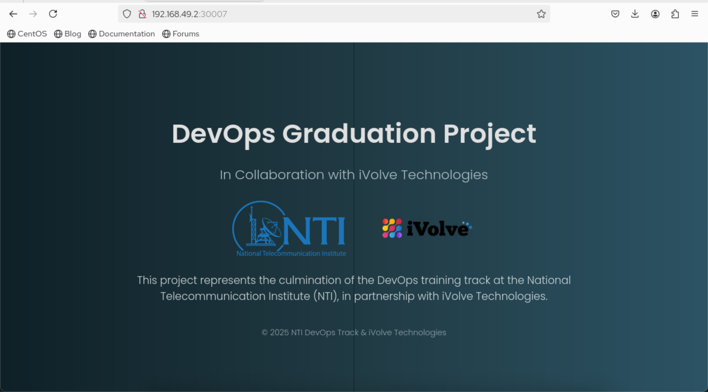
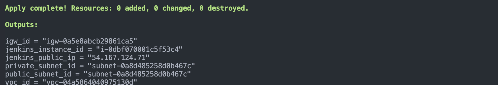
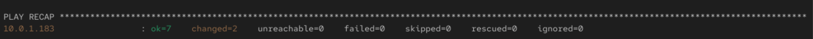
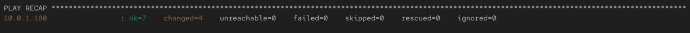
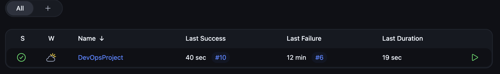
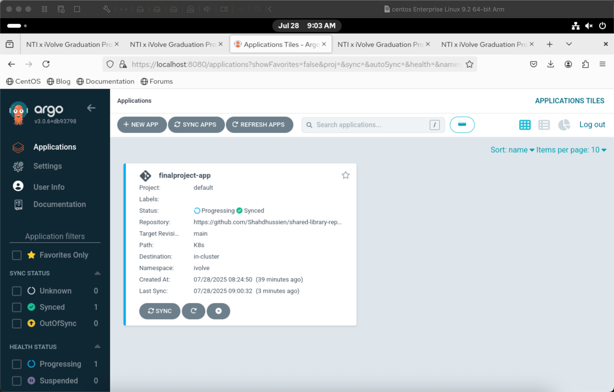

# 🎓 Graduation Project - Cloud DevOps Pipeline Overview

## 📌 Project Description

This project implements a fully automated DevOps pipeline for deploying a cloud-native application on AWS using industry-standard tools like **Terraform**, **Docker**, **Kubernetes**, **Jenkins**, **Ansible**, and **ArgoCD**. It demonstrates real-world DevOps workflows including **Infrastructure as Code (IaC)**, **containerization**, **CI/CD**, **configuration management**, and **GitOps**.

---

## 🗺️ High-Level Architecture

![[Project Architecture]](screanshots/ArchW.png)

---

## 📁 Project Structure

```bash
.
├── terraform/               # Terraform Infrastructure
│   ├── main.tf
│   ├── bootstrap_backend.tf
│   ├── terraform.tfvars
│   └── modules/
│       ├── eks/
│       ├── network/
│       └── server/
├── ansible/                 # Playbooks and Roles for Jenkins and EC2
│   ├── playbook.yml
│   ├── agent-playbook.yml
│   ├── aws_ec2.yaml         # Dynamic Inventory
│   └── roles/
│       ├── common/
│       └── jenkins/
├── CI-CD/
│   ├── Jenkinsfile          # CI Pipeline
│   └── vars/                # Shared Library
│   └── K8s/                 # K8s manifests (Deployment, Service)
├── Dockerfile               # Dockerfile for the Flask app
├── app.py                   # Flask application code
├── requirements.txt
└── argocd/
    └── app-argocd.yaml      # ArgoCD Application config
```

## ✅ What's Included?

* **Source Code:**
  [FinalProject](https://github.com/Shahdhussien/CloudDevOpsProject)

---

## 🐳 1. Containerization with Docker

### 🔧 Task:

Build a Docker image for a Python Flask web application using a Dockerfile.

### 🔨 Tools Used:

* Docker
* Python Flask

### 📁 Implementation:

> Dockerfile: [./Dockerfile](./Dockerfile)
> Application Files: [app.py](./app.py), [requirements.txt](./requirements.txt)

To build the image locally:

```bash
docker build -t flask-final-app:latest .
```

```bash
flask-final-app   latest   51e7f2006825   43 hours ago   464MB
```

### 🎯 Outcome:

A lightweight and reproducible Docker image ready to be deployed in Kubernetes.

---

## ☸️ 2. Container Orchestration with Kubernetes

### 🔧 Task:

Deploy the containerized application into a Kubernetes cluster.

### 📋 Steps:

* Create a namespace `iVolve`
* Define a `Deployment` for managing pods
* Create a `NodePort Service` to expose the app

### 📄 Kubernetes Manifests:

* [Namespace YAML](kubernetes/namespace.yaml)
* [Deployment YAML](kubernetes/deployment.yaml)
* [Service YAML](kubernetes/service.yaml)

To apply:

```bash
kubectl apply -f CI-CD/K8s/
```

To verify:

```bash
kubectl get all -n ivolve
```

**Output:**

```bash
NAME                                           READY   STATUS    RESTARTS   AGE
pod/finalproject-deployment-68c45b459f-rpn5j   1/1     Running   0          4m

NAME                           TYPE       CLUSTER-IP       EXTERNAL-IP   PORT(S)        AGE
service/finalproject-service   NodePort   10.110.103.248   <none>        80:30007/TCP   43h

NAME                                      READY   UP-TO-DATE   AVAILABLE   AGE
deployment.apps/finalproject-deployment   1/1     1            1           43h
```



### 🎯 Outcome:

Declarative manifests ready for automated deployment via ArgoCD.

---

## 🏗️ 3. Infrastructure Provisioning with Terraform

### 🔧 Task:

Provision the entire AWS infrastructure using Terraform modules.

### 🧱 Modules:

* `network`: VPC, Subnets, IGW, NACL
* `server`: EC2 for Jenkins, Security Groups, CloudWatch
* `eks`: EKS cluster (optional)

### ☁️ Backend:

Remote backend using **S3** and **DynamoDB** for state management and team collaboration.

### 📁 Files:

* [main.tf](Terraform/main.tf)
* [variables.tf](Terraform/variables.tf)
* [Modules](Terraform/modules)

To deploy infrastructure:

```bash
terraform init
terraform apply
```



### 🎯 Outcome:

Modular and reusable code for consistent and automated environment setup.

---

## 🛠️ 4. Configuration Management with Ansible

### 🔧 Task:

Configure EC2 instances automatically for Jenkins Master and Agent using Ansible.

### 📂 Roles:

* `common`: Git, Docker, Java
* `jenkins`: Jenkins setup (on Master)

### 🧠 Dynamic Inventory:

Auto-discovery of EC2 instances via tags using `aws_ec2.yaml`.

### 📁 Files:

* [Jenkins Master Playbook](ansible/playbook.yml)
* [Jenkins Agent Playbook](ansible/agent-playbook.yml)
* [Inventory Config](ansible/aws_ec2.yaml)
* [Roles](ansible/roles)

### ▶️ Run:

```bash
ansible-playbook -i aws_ec2.yaml playbook.yml
ansible-playbook -i aws_ec2.yaml agent-playbook.yml
```




### 🎯 Outcome:

Fully configured Jenkins Master and Agent environments without manual setup.

---

## 🔁 5. Continuous Integration with Jenkins

### 🔧 Task:

Create a Jenkins pipeline to automate Docker image builds and K8s manifest updates.

### 🧱 Stages:

1. Build Docker image
2. Scan image (optional)
3. Push to Docker Hub
4. Delete local image
5. Update Kubernetes YAMLs
6. Push updates to Git (ArgoCD sync)

### ⚙️ Architecture:

* Jenkins Master EC2 instance
* Agent EC2 instance (SSH-connected)

### 📁 Files:

* [Jenkinsfile](https://github.com/Shahdhussien/shared-library-repo-/blob/main/Jenkinsfile)
* [Shared Library](https://github.com/Shahdhussien/shared-library-repo-/tree/main/vars)

### 🖥️ Screenshots:



Check The Output:


* [Pipeline](pipeline.txt)


### 🎯 Outcome:

A modular and scalable CI pipeline integrated with Git and Kubernetes.

---

## 🚀 6. Continuous Deployment with ArgoCD (GitOps)

### 🔧 Task:

Enable GitOps by using ArgoCD to automatically deploy changes pushed to Git.

### ⚙️ How it Works:

* Monitors Git repo for manifest changes
* Syncs changes into the Kubernetes cluster in real-time

### 📁 File:

* [ArgoCD Config](https://github.com/Shahdhussien/shared-library-repo-/blob/main/app-argocd.yaml)

### ▶️ Apply:

```bash
kubectl apply -f argocd/app-argocd.yaml
```



### 🎯 Outcome:

Git-driven automated deployment with zero manual syncing.

---

## 🧰 Technologies Used

* **Terraform** – Infrastructure provisioning
* **Ansible** – Configuration management with dynamic inventory
* **Jenkins** – CI (Master/Agent) with Groovy Shared Libraries
* **Docker** – Containerization
* **Kubernetes** – Orchestration (via EKS or local)
* **ArgoCD** – GitOps-based CD
* **AWS** – EC2, S3, IAM, CloudWatch, DynamoDB

---

## 👩‍💻 Author

### Shahd Hussein

**DevOps Engineer**
🔗 [LinkedIn](www.linkedin.com/in/shahd-hussien-ab7162339)
